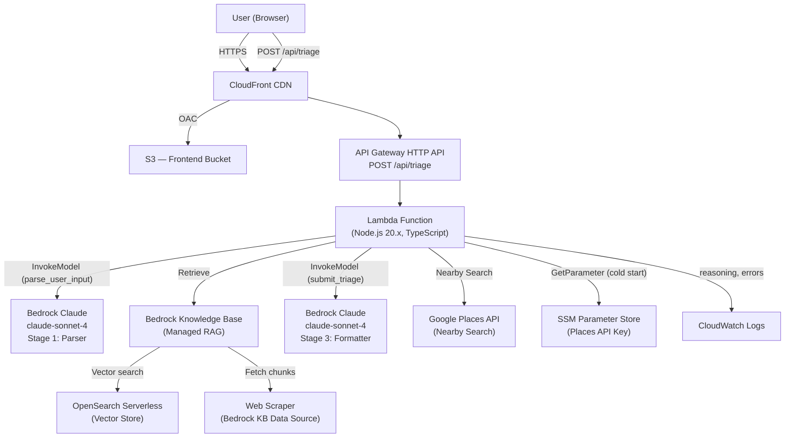
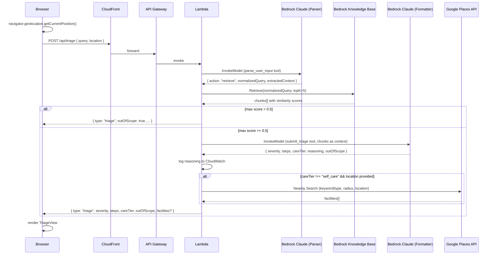
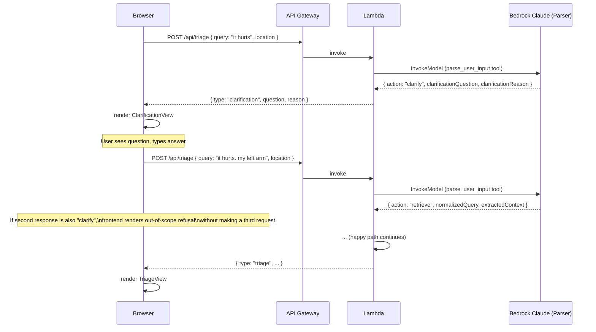

# FirstAid AI — Design

## System Architecture

### Overview

FirstAid AI is a fully serverless, AWS-native application. The frontend is a React SPA served from S3 via CloudFront. The backend is a single Lambda function exposed through API Gateway HTTP API. The LLM pipeline runs entirely within Lambda, orchestrating two Bedrock Claude invocations and one Knowledge Base retrieval call per happy-path request.



---

## Sequence Diagrams

### Happy Path (retrieve → triage with facilities)



### Clarification Path



---

## API Contract

### Endpoint

```
POST /api/triage
Content-Type: application/json
```

### Request Body

```typescript
interface TriageRequest {
  query: string;          // required, 1–500 characters
  location?: {
    lat: number;          // decimal degrees
    lng: number;          // decimal degrees
  };
}
```

### Response: Triage

```typescript
interface TriageResponse {
  type: "triage";
  severity: "self_care" | "urgent_care" | "emergency";
  steps: string[];        // 3–5 items, each ≤ 120 characters
  careTier: "self_care" | "urgent_care" | "emergency";
  outOfScope: boolean;
  facilities?: Facility[];
}

interface Facility {
  name: string;
  address: string;
  distanceMeters: number;
  openNow: boolean;
  lat: number;
  lng: number;
  placeId: string;
}
```

### Response: Clarification

```typescript
interface ClarificationResponse {
  type: "clarification";
  question: string;       // single sentence, ≤ 15 words
  reason: "too_vague" | "missing_severity" | "missing_subject" | "non_medical" | "ambiguous_scenario";
}
```

### Error Responses

```typescript
// 503 — Bedrock or retrieval unavailable
{ error: "parser_unavailable" }
{ error: "retrieval_unavailable" }
{ error: "triage_unavailable" }

// 400 — Invalid request
{ error: "invalid_request", message: string }

// 504 — Lambda timeout (API Gateway generated)
// Body: API Gateway default timeout response
```

### CORS

API Gateway CORS is configured to allow requests from the CloudFront distribution domain only. `Access-Control-Allow-Origin` is set to the CloudFront HTTPS URL. `Access-Control-Allow-Methods: POST`. `Access-Control-Allow-Headers: Content-Type`.

---

## Two-Stage LLM Pipeline Rationale

### Why Parser-Then-Formatter Outperforms Single-Shot

A single Claude invocation asked to simultaneously understand the user's intent, retrieve relevant content, and format a triage card produces worse results on all three dimensions than a pipeline that separates concerns.

**Retrieval quality:** The user's raw input ("my kid burned his hand") is not an optimal retrieval query. A parser that normalizes it to "pediatric thermal burn hand first aid steps" produces significantly better vector similarity matches against a medical corpus. Garbage-in-garbage-out at the RAG layer is the primary failure mode of naive single-shot RAG.

**Clarification capability:** A single-shot approach cannot cleanly separate "I need more information" from "here is your answer." The parser's structured tool output (`action: "clarify" | "retrieve"`) gives Lambda a deterministic branch point. The clarification question is constrained to 15 words and a typed reason enum, preventing verbose hedging.

**Output formatting:** The formatter operates on retrieved chunks, not on the user's raw input. It is constrained to produce 3–5 imperative steps under 120 characters each, grounded strictly in the retrieved context. This separation means the formatter prompt can be tuned purely for compression and clarity, without also needing to handle intent disambiguation.

**Summary of pipeline stages:**

| Stage | Input | Output | Claude invocation |
|---|---|---|---|
| 1 — Parser | Raw user query | `normalizedQuery` or `clarificationQuestion` | Yes (parse_user_input tool) |
| 2 — Retrieval | `normalizedQuery` | Top 5 chunks with similarity scores | No (Bedrock KB API) |
| 3 — Formatter | Retrieved chunks | Structured triage card | Yes (submit_triage tool) |

---

## Bedrock Tool Use Schemas

### Stage 1: parse_user_input Tool Definition

> **Note:** The system prompt for this tool is hand-tuned by the development team and is NOT generated by Kiro. See system prompt section below.

```typescript
const parseUserInputTool = {
  name: "parse_user_input",
  description: "Parse the user's described situation into either a normalized retrieval query or a clarification request.",
  input_schema: {
    type: "object",
    properties: {
      action: {
        type: "string",
        enum: ["retrieve", "clarify"]
      },
      normalizedQuery: {
        type: "string",
        description: "A concise, retrieval-optimized phrasing of the user's situation. Required when action === 'retrieve'."
      },
      extractedContext: {
        type: "object",
        description: "Structured context extracted from input. Required when action === 'retrieve'.",
        properties: {
          scenario: {
            type: "string",
            description: "Primary scenario tag, e.g., 'burn', 'cut', 'allergic_reaction'"
          },
          severity_signals: {
            type: "array",
            items: { type: "string" },
            description: "Phrases indicating severity"
          },
          subject: {
            type: "string",
            description: "Who the situation is about, e.g., 'self', 'child', 'adult'"
          }
        }
      },
      clarificationQuestion: {
        type: "string",
        description: "A single short question to ask the user. Required when action === 'clarify'. Maximum 15 words."
      },
      clarificationReason: {
        type: "string",
        enum: ["too_vague", "missing_severity", "missing_subject", "non_medical", "ambiguous_scenario"],
        description: "Why clarification is needed. Required when action === 'clarify'."
      }
    },
    required: ["action"]
  }
};
```

### Stage 3: submit_triage Tool Definition

> **Note:** The system prompt for this tool is hand-tuned by the development team and is NOT generated by Kiro. See system prompt section below.

```typescript
const submitTriageTool = {
  name: "submit_triage",
  description: "Submit the final triage card based strictly on the retrieved medical protocol context.",
  input_schema: {
    type: "object",
    properties: {
      severity: {
        type: "string",
        enum: ["self_care", "urgent_care", "emergency"]
      },
      steps: {
        type: "array",
        items: { type: "string", maxLength: 120 },
        minItems: 3,
        maxItems: 5,
        description: "Numbered first aid steps, each under 120 characters, written in clear imperative voice for a panicked layperson."
      },
      careTier: {
        type: "string",
        enum: ["self_care", "urgent_care", "emergency"]
      },
      reasoning: {
        type: "string",
        description: "Brief internal rationale for severity assignment. Logged server-side only."
      },
      outOfScope: {
        type: "boolean"
      }
    },
    required: ["severity", "steps", "careTier", "reasoning", "outOfScope"]
  }
};
```

---

## System Prompts (Hand-Tuned Design Artifacts)

> **IMPORTANT:** Both system prompts below are hand-tuned by the development team. They are design artifacts, not generated output. Do not modify them via automated tooling. Changes require deliberate human review and testing against the five demo scenarios.

### Parser System Prompt

```
You are a medical triage input parser. Your only job is to call the parse_user_input tool.

Rules:
- Default to action "retrieve" when the scenario and at least one severity signal are reasonably inferable from the input.
- A short but clear input ("kid burned hand on stove") is sufficient to retrieve. Do not ask for clarification on clear inputs.
- Use action "clarify" only when: the input is non-medical, the scenario cannot be guessed, severity signals are entirely absent AND the answer depends on severity, or the subject is unclear in a way that materially affects triage.
- Clarification questions must be a single sentence, under 15 words, asking only for the single most diagnostically important missing piece of information.
- Bias toward retrieve. When in doubt, retrieve.
- Never produce prose. Only call the tool.
```

### Formatter System Prompt

```
You are a medical triage formatter. Your only job is to call the submit_triage tool.

Rules:
- Answer ONLY from the provided retrieval context. Do not use your general medical knowledge.
- Each step must be under 120 characters, written in clear imperative voice, with no medical jargon.
- Produce exactly 3 to 5 steps. Distill the protocol — do not enumerate every sub-step.
- If the retrieval context is thin, ambiguous, or does not clearly address the scenario, set outOfScope to true.
- Bias toward over-escalation on severity. When uncertain between urgent_care and emergency, choose emergency.
- Never produce prose. Only call the tool.
```

---

## Lambda Handler Structure

```typescript
// handler.ts — orchestration pseudocode

export const handler = async (event: APIGatewayProxyEventV2) => {
  // 1. Parse and validate request body
  const { query, location } = parseRequest(event);

  // 2. Read Places API key from SSM (cached at module scope after cold start)
  const placesApiKey = await getPlacesApiKey();

  // 3. Stage 1: Parser
  let parserResult;
  try {
    parserResult = await invokeParser(query);
  } catch (err) {
    return errorResponse(503, "parser_unavailable");
  }

  // 4. Clarification short-circuit
  if (parserResult.action === "clarify") {
    return clarificationResponse(parserResult.clarificationQuestion, parserResult.clarificationReason);
  }

  // 5. Stage 2: Knowledge Base Retrieval
  let chunks;
  try {
    chunks = await retrieveFromKnowledgeBase(parserResult.normalizedQuery);
  } catch (err) {
    return errorResponse(503, "retrieval_unavailable");
  }

  // 6. Similarity threshold gate
  const maxScore = Math.max(...chunks.map(c => c.score));
  if (maxScore < SIMILARITY_THRESHOLD) {
    return outOfScopeResponse();
  }

  // 7. Stage 3: Formatter
  let formatterResult;
  try {
    formatterResult = await invokeFormatter(chunks, parserResult.extractedContext);
  } catch (err) {
    return errorResponse(503, "triage_unavailable");
  }

  // 8. Log reasoning (never returned to client)
  console.log(JSON.stringify({ reasoning: formatterResult.reasoning, query }));

  // 9. Out-of-scope from formatter
  if (formatterResult.outOfScope) {
    return outOfScopeResponse();
  }

  // 10. Service finder (non-blocking)
  let facilities: Facility[] = [];
  if (formatterResult.careTier !== "self_care" && location) {
    try {
      facilities = await findNearbyFacilities(formatterResult.careTier, location, placesApiKey);
    } catch (err) {
      // Degrade gracefully — triage still returned
      console.error("Places API error:", err);
    }
  }

  // 11. Return combined response
  return triageResponse(formatterResult, facilities);
};
```

### Environment Variables

| Variable | Value | Source |
|---|---|---|
| `KNOWLEDGE_BASE_ID` | Bedrock KB ID | Lambda env var |
| `CLAUDE_MODEL_ID` | `anthropic.claude-sonnet-4-20250514-v1:0` | Lambda env var |
| `SIMILARITY_THRESHOLD` | `0.5` | Lambda env var (default) |
| `PLACES_API_KEY_PARAM` | SSM parameter path | Lambda env var |
| `AWS_REGION` | `us-west-2` or `us-east-1` | Lambda runtime |

---

## Bedrock Knowledge Base Configuration

| Property | Value |
|---|---|
| Data source | Bedrock built-in web scraper (curated URLs from NHS 111, MedlinePlus, CDC, Red Cross, WHO) |
| Chunking strategy | Fixed-size, ~300 tokens, 20% overlap |
| Embedding model | Amazon Titan Text Embeddings v2 |
| Vector store | OpenSearch Serverless |
| Retrieval top-K | 5 |
| Similarity threshold | 0.5 (configurable via Lambda env var) |

### Source URL Specification

- **Sources:** NHS 111, MedlinePlus, CDC, Red Cross, WHO basic emergency care guidelines
- **Scope:** 15–20 scenarios: burns, cuts, choking, allergic reactions, head injuries, chest pain, fainting, poisoning, sprains, eye injuries, nosebleeds, animal bites, seizures, asthma attacks, hypoglycemia
- **Format:** Web scraper data source configured in Bedrock Knowledge Base console — no S3 bucket or local files required

---

## IAM Role Definitions

### Lambda Execution Role

```json
{
  "Version": "2012-10-17",
  "Statement": [
    {
      "Sid": "BedrockInvokeModel",
      "Effect": "Allow",
      "Action": ["bedrock:InvokeModel"],
      "Resource": "arn:aws:bedrock:{region}::foundation-model/anthropic.claude-sonnet-4-20250514-v1:0"
    },
    {
      "Sid": "BedrockKBRetrieve",
      "Effect": "Allow",
      "Action": ["bedrock-agent-runtime:Retrieve"],
      "Resource": "arn:aws:bedrock:{region}:{account}:knowledge-base/{kb-id}"
    },
    {
      "Sid": "SSMGetParameter",
      "Effect": "Allow",
      "Action": ["ssm:GetParameter"],
      "Resource": "arn:aws:ssm:{region}:{account}:parameter/firstaid-ai/places-api-key"
    },
    {
      "Sid": "CloudWatchLogs",
      "Effect": "Allow",
      "Action": [
        "logs:CreateLogGroup",
        "logs:CreateLogStream",
        "logs:PutLogEvents"
      ],
      "Resource": "arn:aws:logs:{region}:{account}:log-group:/aws/lambda/firstaid-ai-triage:*"
    }
  ]
}
```

### Bedrock Knowledge Base Service Role

```json
{
  "Version": "2012-10-17",
  "Statement": [
    {
      "Sid": "OpenSearchServerlessAccess",
      "Effect": "Allow",
      "Action": ["aoss:APIAccessAll"],
      "Resource": "arn:aws:aoss:{region}:{account}:collection/{collection-id}"
    }
  ]
}
```

### CloudFront → S3 Origin Access Control

The frontend S3 bucket policy grants `s3:GetObject` to the CloudFront service principal with a condition on the CloudFront distribution ARN. Direct S3 access is denied to all other principals.

---

## Error Handling Implementation

| Failure Mode | Lambda Behavior | Response |
|---|---|---|
| Parser InvokeModel throws | Catch, log error, return 503 | `{ error: "parser_unavailable" }` |
| Parser returns unexpected shape | Treat as parser failure, return 503 | `{ error: "parser_unavailable" }` |
| KB Retrieve throws | Catch, log error, return 503 | `{ error: "retrieval_unavailable" }` |
| Max similarity < threshold | Return out-of-scope triage response | `{ type: "triage", severity: "self_care", steps: [], careTier: "self_care", outOfScope: true }` |
| Formatter InvokeModel throws | Catch, log error, return 503 | `{ error: "triage_unavailable" }` |
| Formatter returns outOfScope: true | Return out-of-scope triage response | Same as above |
| Places API throws or times out | Log error, continue with empty facilities | `{ type: "triage", ..., facilities: [] }` |
| Lambda timeout (15s) | API Gateway generates 504 | API Gateway default 504 body |
| Invalid request body | Return 400 | `{ error: "invalid_request", message: "..." }` |

---

## Frontend Component Hierarchy

```
App
├── LandingView
│   └── QueryInput (text field, submit button, optional Web Speech mic)
├── ClarificationView
│   ├── ClarificationPrompt (displays parser's question)
│   ├── OriginalQueryDisplay (shows user's first input as immutable context)
│   └── ClarificationInput (text field for clarifying answer)
├── TriageView
│   ├── SeverityBanner (color-coded: green/yellow/red)
│   ├── StepsList (numbered first aid steps)
│   ├── CareTierAction (recommended care tier with action label)
│   ├── EmergencyNumberCallout (visible only when severity === "emergency")
│   ├── FacilityMap (Leaflet map, visible only when facilities present)
│   └── OutOfScopeRefusal (visible only when outOfScope === true)
└── DisclaimerFooter (persistent across all views)
ErrorState (503/504 responses)
LoadingState (in-flight request)
```

### Component Responsibilities

**QueryInput:** Autofocused text field, 500-char limit with counter, Enter-key submit, submit button, disabled state during loading. Optional microphone button (FR1.1 stretch).

**ClarificationView:** Renders when API response `type === "clarification"`. Displays `question` prominently. Shows original query as immutable label. Provides new input field. On submit, concatenates `${originalQuery}. ${answer}` and POSTs. Tracks clarification count in component state; if count ≥ 1 and response is again clarification, renders OutOfScopeRefusal instead.

**SeverityBanner:** Receives `severity` prop. Applies Tailwind classes: `bg-green-500` (self_care), `bg-yellow-400` (urgent_care), `bg-red-600` (emergency). Text is white with minimum 24px font. Must meet WCAG AAA contrast.

**StepsList:** Renders `steps` array as `<ol>` with `<li>` items. Line height 1.5 minimum. Each item is a full sentence in imperative voice.

**CareTierAction:** Maps `careTier` to action label string. Renders as prominent call-to-action below steps.

**EmergencyNumberCallout:** Conditionally rendered when `severity === "emergency"`. Displays "Call 911" in large type. Touch target ≥ 44×44px.

**FacilityMap:** Leaflet map initialized with user coordinates as center. Renders facility pins and user marker. Handles pin tap → info window. Info window contains facility name, distance in miles/km, and "Get Directions" button.

**DisclaimerFooter:** Static component, always rendered. `<footer>` element with `role="contentinfo"`.

**LoadingState:** Renders spinner or skeleton. Announces loading to screen readers via `aria-live="polite"`.

**ErrorState:** Renders error message in plain language. Includes retry button. Announces error via `aria-live="assertive"`.

---

## Deployment Topology

```
┌─────────────────────────────────────────────────────────┐
│                        us-west-2                        │
│                                                         │
│  ┌──────────────┐    ┌──────────────────────────────┐  │
│  │  CloudFront  │───▶│  S3 (Frontend)               │  │
│  │  Distribution│    │  React SPA (index.html,      │  │
│  │  (HTTPS)     │    │  assets, JS bundles)         │  │
│  └──────┬───────┘    └──────────────────────────────┘  │
│         │                                               │
│         ▼                                               │
│  ┌──────────────┐    ┌──────────────────────────────┐  │
│  │  API Gateway │───▶│  Lambda Function             │  │
│  │  HTTP API    │    │  firstaid-ai-triage          │  │
│  │  POST /api/  │    │  Node.js 20.x, 512MB, 15s   │  │
│  │  triage      │    └──────────────────────────────┘  │
│  └──────────────┘                                       │
│                                                         │
│  ┌──────────────────────────────────────────────────┐  │
│  │  Bedrock                                         │  │
│  │  ├── Claude claude-sonnet-4 (Parser + Formatter) │  │
│  │  └── Knowledge Base → OpenSearch Serverless      │  │
│  └──────────────────────────────────────────────────┘  │
│                                                         │
│  ┌──────────────┐    ┌──────────────────────────────┐  │
│  │  Web Scraper │    │  SSM Parameter Store         │  │
│  │  (KB source) │    │  /firstaid-ai/places-api-key │  │
│  └──────────────┘    └──────────────────────────────┘  │
└─────────────────────────────────────────────────────────┘
                              │
                              ▼ (outbound HTTPS)
                    Google Places API
```

### Lambda Configuration

| Property | Value |
|---|---|
| Runtime | Node.js 20.x |
| Memory | 512 MB |
| Timeout | 15 seconds |
| Architecture | x86_64 |
| Handler | `dist/handler.handler` |

### Frontend Build and Deploy

```bash
# Build
npm run build   # Vite produces dist/

# Deploy to S3
aws s3 sync dist/ s3://firstaid-ai-frontend/ --delete

# Invalidate CloudFront cache
aws cloudfront create-invalidation --distribution-id {ID} --paths "/*"
```

### Backend Build and Deploy

```bash
# Build TypeScript
npm run build   # esbuild bundles to dist/handler.js

# Deploy Lambda
aws lambda update-function-code \
  --function-name firstaid-ai-triage \
  --zip-file fileb://dist/handler.zip
```

---

## Kiro Development Integration

### Overview

This project uses Kiro as the primary development environment. Kiro's spec-driven workflow, agent hooks, and steering files are configured to accelerate the 7-hour hackathon build window.

### Spec-Driven Workflow

The three spec files (`requirements.md`, `design.md`, `tasks.md`) are the authoritative source of truth for the build. Kiro's task execution agent reads `tasks.md` and executes tasks in order, updating task status as work progresses.

### Steering Files

Steering files in `.kiro/steering/` provide persistent context to the Kiro agent across sessions:

| File | Purpose |
|---|---|
| `architecture.md` | AWS service topology, Lambda handler structure, environment variables |
| `api-contract.md` | POST /api/triage request/response shapes, error codes |
| `tool-schemas.md` | Verbatim parse_user_input and submit_triage tool definitions |
| `component-map.md` | Frontend component hierarchy and responsibilities |
| `demo-scenarios.md` | Five demo scenarios with expected inputs and outputs |

### Agent Hooks

| Hook | Trigger | Action |
|---|---|---|
| `post-lambda-edit` | Lambda handler file edited | Run TypeScript compiler, report errors |
| `post-component-edit` | React component file edited | Run ESLint + accessibility lint |
| `pre-deploy` | Deploy script triggered | Verify build succeeds, run type check |

### What Is Hand-Tuned and Why

The following artifacts are explicitly NOT generated by Kiro and must be authored and maintained by the development team:

| Artifact | Reason |
|---|---|
| Parser system prompt | Requires deliberate calibration of retrieve/clarify bias. Over-clarification degrades UX; under-clarification degrades retrieval quality. Must be tested against all five demo scenarios. |
| Formatter system prompt | Requires calibration of step count, character limit enforcement, over-escalation bias, and out-of-scope threshold. Medical accuracy depends on prompt constraints. |
| Similarity threshold (0.5) | Empirically determined against the scraped content. May need adjustment after ingestion. |
| Source URL selection | Requires human judgment on source authority, coverage gaps, and scenario coverage across the 15–20 target scenarios. |

---

## Shared TypeScript Types

```typescript
// types/api.ts

export type Severity = "self_care" | "urgent_care" | "emergency";
export type ClarificationReason =
  | "too_vague"
  | "missing_severity"
  | "missing_subject"
  | "non_medical"
  | "ambiguous_scenario";

export interface TriageRequest {
  query: string;
  location?: { lat: number; lng: number };
}

export interface Facility {
  name: string;
  address: string;
  distanceMeters: number;
  openNow: boolean;
  lat: number;
  lng: number;
  placeId: string;
}

export interface TriageResponse {
  type: "triage";
  severity: Severity;
  steps: string[];
  careTier: Severity;
  outOfScope: boolean;
  facilities?: Facility[];
}

export interface ClarificationResponse {
  type: "clarification";
  question: string;
  reason: ClarificationReason;
}

export interface ErrorResponse {
  error: "parser_unavailable" | "retrieval_unavailable" | "triage_unavailable" | "invalid_request";
  message?: string;
}

export type ApiResponse = TriageResponse | ClarificationResponse;
```
